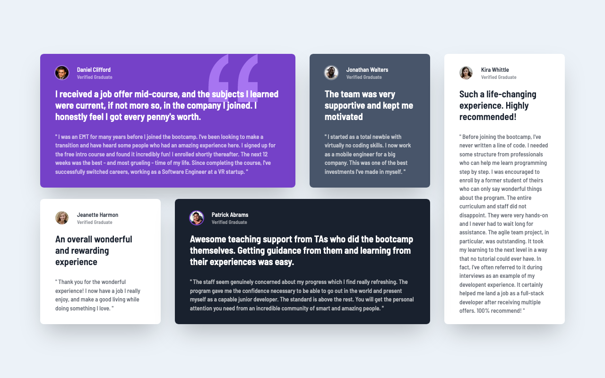
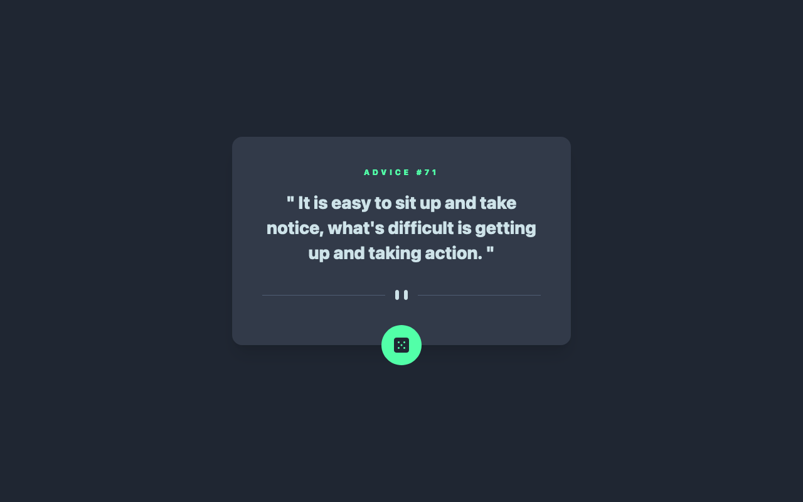

# Frontend Mentor Challenges - Green

A mono repository for my solutions to the 🟢Junior [Frontend Mentor](https://www.frontendmentor.io/challenges) challenges. All submitted solutions are also available [here](https://www.frontendmentor.io/profile/n0rrman/solutions), on my Frontend Mentor profile.

The challenges are solved using [Next.js](https://nextjs.org/), [Tailwind CSS](https://tailwindcss.com/), and [TypeScript](https://www.typescriptlang.org).

---

<!-- 🔴Guru 🟠Advanced 🟡Intermediate 🟢Junior 🔵Newbie -->

| Challenge | Level | Repository | Live version | Screenshot |
|-----------|-------|------------|--------------|------------|
| [Testimonials grid section](https://www.frontendmentor.io/solutions/testimonials-grid-section-tailwindcss-and-nextjs-pyf7uz8oML)  | 🟢Junior | [testimonials-grid-section](https://github.com/n0rrman/frontend-mentor-challenges-green/tree/main/testimonials-grid-section) | [Vercel](https://testimonials-grid-section-brown-eight.vercel.app) |  |
| [-](https://www.frontendmentor.io/solutions/advice-generator-app-tailwindcss-and-nextjs-xF8NQTU5DO)  | 🟢Junior | [advice-generator-app](https://github.com/n0rrman/frontend-mentor-challenges-green/tree/main/advice-generator-app) | [Vercel](https://advice-generator-app-alpha-tan.vercel.app) |  |

<!--
| [-](...)  | 🟢Junior | [...](https://github.com/n0rrman/frontend-mentor-challenges/tree/main/...) | [Vercel](https://....vercel.app) |  |
-->