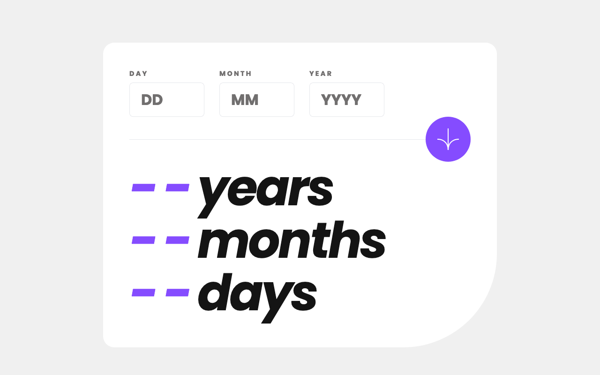
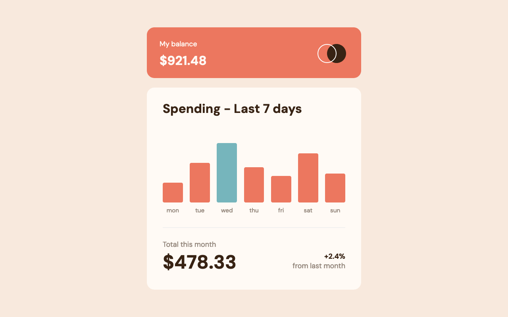

# Frontend Mentor Challenges - Green

A mono repository for my solutions to the 🟢Junior [Frontend Mentor](https://www.frontendmentor.io/challenges) challenges. All submitted solutions are also available [here](https://www.frontendmentor.io/profile/n0rrman/solutions), on my Frontend Mentor profile.

The challenges are solved using [Next.js](https://nextjs.org/) or [Angular](https://angular.dev), [Tailwind CSS](https://tailwindcss.com/), and [TypeScript](https://www.typescriptlang.org).

---

<!-- 游댮Guru 游ㅁdvanced 游리Intermediate 🟢Junior 游댯Newbie -->

| Challenge | Level | Repository | Live version | Framework | Screenshot |
|-----------|-------|------------|--------------|----------|--|
| [Testimonials grid section](https://www.frontendmentor.io/solutions/testimonials-grid-section-tailwindcss-and-nextjs-pyf7uz8oML)  | 🟢Junior | [testimonials-grid-section](https://github.com/n0rrman/frontend-mentor-challenges-green/tree/main/testimonials-grid-section) | [Vercel](https://testimonials-grid-section-brown-eight.vercel.app) | NextJS & TailwindCSS |  |
| [Advice generator app](https://www.frontendmentor.io/solutions/advice-generator-app-tailwindcss-and-nextjs-xF8NQTU5DO)  | 🟢Junior | [advice-generator-app](https://github.com/n0rrman/frontend-mentor-challenges-green/tree/main/advice-generator-app) | [Vercel](https://advice-generator-app-alpha-tan.vercel.app) | NextJS & TailwindCSS |  |
| [Fylo data storage component](https://www.frontendmentor.io/solutions/fylo-data-storage-component-tailwindcss-and-nextjs-W41eOWyaKC)  | 🟢Junior | [fylo-data-storage-component](https://github.com/n0rrman/frontend-mentor-challenges-green/tree/main/fylo-data-storage-component) | [Vercel](https://fylo-data-storage-component-one-sooty.vercel.app) | NextJS & TailwindCSS |  |
| [Age calculator app](https://www.frontendmentor.io/solutions/age-calculator-app-tailwindcss-and-nextjs-8dPs8EEfuj)  | 🟢Junior | [age-calculator-app](https://github.com/n0rrman/frontend-mentor-challenges-green/tree/main/age-calculator-app) | [Vercel](https://age-calculator-app-rho-self.vercel.app) | NextJS & TailwindCSS |  |
| [Expenses chart component](https://www.frontendmentor.io/solutions/expenses-chart-component-tailwind-and-nextjs-cZhGPQH4ix)  | 🟢Junior | [expenses-chart-component](https://github.com/n0rrman/frontend-mentor-challenges-green/tree/main/expenses-chart-component) | [Vercel](https://expenses-chart-component-ashen.vercel.app) | NextJS & TailwindCSS |  |
| [Clipboard landing page](https://www.frontendmentor.io/solutions/clipboard-landing-page-tailwind-and-nextjs-h9sOK3kmDq)  | 🟢Junior | [clipboard-landing-page](https://github.com/n0rrman/frontend-mentor-challenges-green/tree/main/clipboard-landing-page) | [Vercel](https://clipboard-landing-page-psi-orpin.vercel.app) | NextJS & TailwindCSS |  |
| [Fylo landing page with two column layout](https://www.frontendmentor.io/solutions/fylo-landing-page-with-two-column-layout-tailwindcss-and-nextjs-rTlWP8loui)  | 🟢Junior | [fylo-landing-page-with-two-column-layout](https://github.com/n0rrman/frontend-mentor-challenges-green/tree/main/fylo-landing-page-with-two-column-layout) | [Vercel](https://fylo-landing-page-with-two-column-layout-kappa.vercel.app) | NextJS & TailwindCSS |  |
| [Huddle landing page with alternating feature blocks](https://www.frontendmentor.io/solutions/huddle-landing-page-with-alternating-feature-blocks-tailwind-and-next-UsbkjD56by)  | 🟢Junior | [huddle-landing-page-with-alternating-feature-blocks](https://github.com/n0rrman/frontend-mentor-challenges-green/tree/main/huddle-landing-page-with-alternating-feature-blocks) | [Vercel](https://huddle-landing-page-with-alternating-feature-blocks-pearl-chi.vercel.app) | NextJS & TailwindCSS |  |

<!--
| [-](...)  | 🟢Junior | [...](https://github.com/n0rrman/frontend-mentor-challenges/tree/main/...) | [Vercel](https://....vercel.app) | NextJS & TailwindCSS |  |
-->