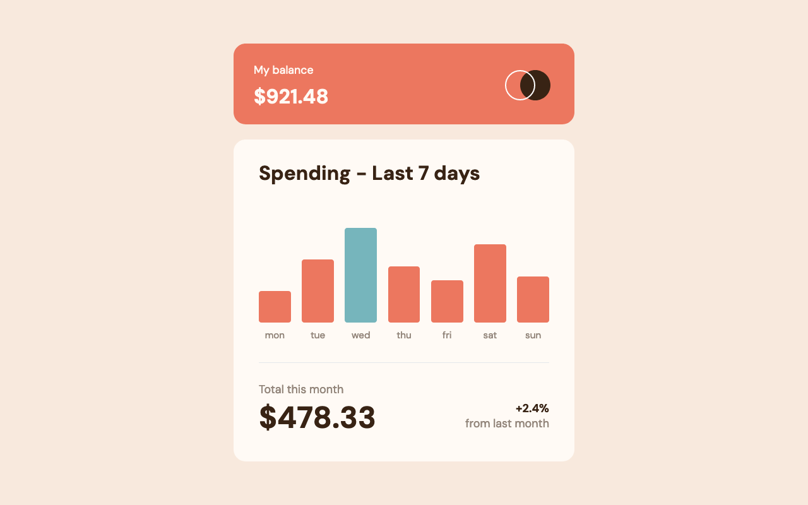

# Frontend Mentor - Expenses chart component solution

This is a solution to the [Expenses chart component challenge on Frontend Mentor](https://www.frontendmentor.io/challenges/expenses-chart-component-e7yJBUdjwt).

### Screenshot

### Links

- Solution URL: [Solution at Frontend Mentor](...)
- Live Site URL: [Live version on Vercel](...)

### Built with

- [Next.js](https://nextjs.org/) - JavaScript framework
- [Tailwind CSS](https://tailwindcss.com/) - CSS framework

